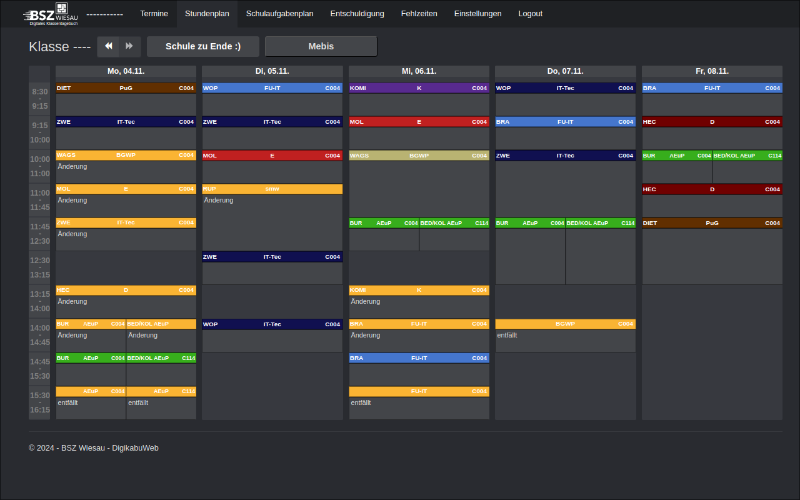

# BestKabu Browser Extension
A Simple Browser extension that makes Digikabu.de better. This is a Fork of [@ouihq](https://github.com/ouihq/betterKabu)

# Usage

### Chromium: [here](https://chromewebstore.google.com/detail/bestkabu/okajcjigbfoadcmmhckdpbopohdkhcpg)
### Firefox: Use the .xpi file in the latest -fire release
**Note:** If you find a relayable way to install the Extension on Firefox on andorid, please let me know. It already should work fine in debugger mode.

## Lesson highlighting
**Note:** Please submit (create an github issue) your school lesson abbreviations to mark them in color 

## Login by Extension

### With Encryption:
1. Open the extension on the digikabu.de website.
2. Enable Login by Extension
3. Enter your username, password, and an encryption key (Note: using a key longer than your credentials is unnecessary).
4. Check the "Enable Password Protection" option.
5. Click the "Save Login" button.
   
**Note:** If no username or password is entered, the existing credentials won't be overwritten.

**To log in:** 
- Open the extension, enter your encryption key, and click "Login."

### Without Encryption:
1. Open the extension on the digikabu.de website.
2. Enable Login by Extension
3. Enter your username and password.
4. Click the "Save Login" button.
   
**Note:** If no username or password is entered, the existing credentials won't be overwritten.

## Preview

## Colorpicker
To change the color of the highlighting: Open the Extension on the digikabu.de website and enter a HEX code in the input field. If you don't know them from memory, click on the link and copy the HEX code from there. A HEX code is always a "#" and 6 digits, that can be "0,1,2,...9, A, B, C, D, E, F".

## Current features:
- Dark mode toggle
- Login by Extension to make login faster
- Custom highlighting
- Time remaining until the next lesson

# Contribution Guide

## Intro

If you want to contribute, you are free to do so. If you have any questions, you are free to do so. If you have found issues oder want to suggest features, you can submit that in GitHub.

## General

For anything, create a pull request with the naming scheme (featue/…  |  fix/…   | refactor/…) and if avalible the reference to the issue, and we test it, or change some things and then merge it into main. For git commit messages please follow this guide: https://www.conventionalcommits.org/en/v1.0.0/. And the commit git e-mail should be the same as your GitHub e-mail. For further questions, please contact us.

### Note
The Makefile is for packaging and only works on Linux. Just ignore it if you're not experienced.

#### Firefox

    $ make pack-fire

#### Chromium

    $ make pack-chr

**contact: bestkabu@vleov.de**

## Contributors ✨

Thanks to all the contributors who helped improve this project:

